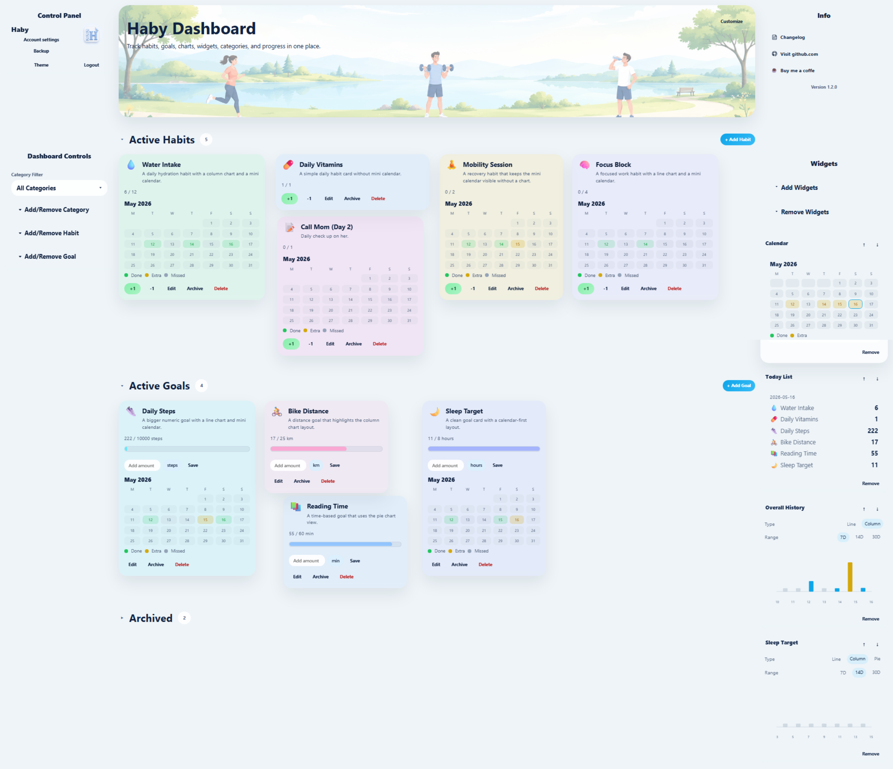
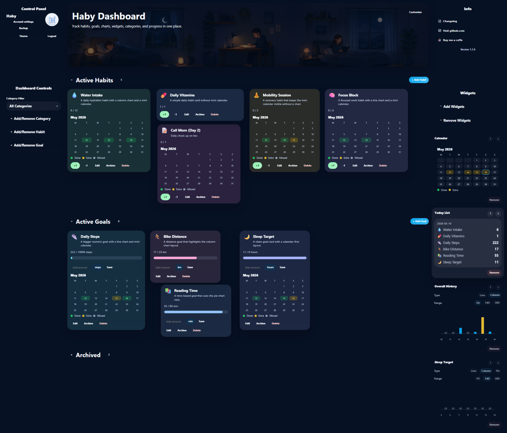

<p align="center">
  
</p>

# Haby

Haby is a self-hosted habit and goal tracker built for private, homelab-friendly deployments. It combines daily habits, progress goals, lightweight widgets, and a clean dashboard into a single containerized app.




## Features

- Multi-user authentication with an admin-managed user list
- Default first-run account with forced password change
- Separate habit and goal cards
- Optional mini calendar and mini chart on each card
- Line, column, and pie card charts
- Right-side widgets for overall history, today list, and calendar views
- Card archiving and archived section support
- Import preview before full import
- Local SQLite persistence in a single `/data` volume
- Docker-first deployment with a production example compose file

## First-run account

The initial first-run account is:

- **Username:** `Haby`
- **Password:** `Haby`

You are prompted to change the password after the first login.

## Demo layout on first run

Haby seeds a curated default dashboard for first-time use and for new users:

### Habit cards
- 1 habit with **column chart + mini calendar**
- 1 habit with **line chart + mini calendar**
- 1 habit with **mini calendar only**
- 1 habit with **no mini calendar and no chart**

### Goal cards
- 4 goal cards with a visual mix of line, column, pie, and calendar-first layouts

### Archive
- 1 archived sample card so the archive section is visible immediately

## Stack

- **Frontend:** React + Vite + TypeScript
- **Backend:** Express + TypeScript
- **Database:** SQLite
- **Container:** Multi-stage Docker build

## Repository structure

```text
.
├── app/
│   ├── client/              # React frontend
│   └── server/              # Express backend
├── compose.yaml.example     # Example Docker Compose file
├── Dockerfile               # Production multi-stage image
├── .env.example             # Optional runtime environment example
├── SECURITY.md              # Security policy and hardening notes
└── docs/
    └── screenshots/         # README screenshots
```

## Local development

```bash
npm install --prefix app
npm install --prefix app/client
npm install --prefix app/server
npm run dev --prefix app/server
npm run dev --prefix app/client
```

## Docker image

Pull the latest image from Docker Hub:

```bash
docker pull zvijer1987/haby:latest
```

## Docker Compose

A commented production example is included in [`compose.yaml.example`](compose.yaml.example).

Quick start:

```bash
cp compose.yaml.example compose.yaml
mkdir -p data
docker compose up -d
```

## Runtime data

Haby stores persistent runtime data in `/data` inside the container. The mounted directory contains:

- the SQLite database
- uploaded profile pictures
- user settings and persisted application state

## Import and export

- Export downloads a dated JSON backup file
- Import runs a preview first
- Import can restore habits, goals, archived cards, entries, categories, and settings

## Security notes

- Change the default password immediately after the first login
- Do not expose Haby directly to the public internet without an authenticated reverse proxy
- Run behind HTTPS when used outside a trusted LAN
- Keep the `/data` volume private and backed up
- Review [`SECURITY.md`](SECURITY.md) before publishing or opening access

## Contributing

See [`CONTRIBUTING.md`](CONTRIBUTING.md) for repository conventions and contribution notes.

## Update notes - v1.1.0

### Repeatable habits and goals

This release improves repeatable habits and goals.

Repeatable cards now use period-based names:

- Daily cards: Habit name (Day 1), Habit name (Day 2), ...
- Weekly cards: Habit name (Week 1), Habit name (Week 2), ...
- Monthly cards: Habit name (Month 1), Habit name (Month 2), ...

When a new repeatable card is created for the next period, the previous card from the same repeat group is automatically archived. The dashboard keeps only the newest active repeatable card.

### Icon picker

The habit and goal icon picker now includes 5 rows of icons.

### Runtime user change

The container now runs as the standard Node.js user:

- UID: 1000
- GID: 1000

This is better for most self-hosted bind mount setups where the mounted data folder is owned by the normal host user.

Existing users who update from an older image may need to fix ownership of their mounted /data folder if they see this SQLite error:

SqliteError: attempt to write a readonly database

For bind-mounted data folders, run:

    sudo docker stop haby
    sudo chown -R 1000:1000 /path/to/haby/data
    sudo chmod -R u+rwX,g+rwX /path/to/haby/data
    sudo docker start haby

Example for a local ./data folder:

    sudo docker stop haby
    sudo chown -R 1000:1000 ./data
    sudo chmod -R u+rwX,g+rwX ./data
    sudo docker start haby

New installations using a normal user-owned bind mount should work without extra permission changes.

## Update notes - v1.2.0

Haby 1.2.0 includes the new full default first-run dashboard, Backup modal, widget-only charts, dashboard banner resizing, improved card layout behavior, updated modern README screenshots, and multiple UI polish fixes.

New first-time installs now start with a complete Haby dashboard setup, including categories, habits, goals, widgets, dashboard layout, card positions, theme, banner size, and sample progress/history entries. Existing users are protected by a `defaultSeedApplied` marker so updates do not overwrite existing data.
